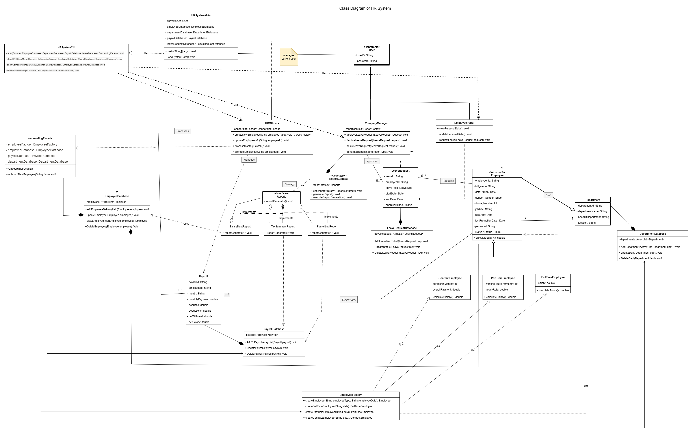
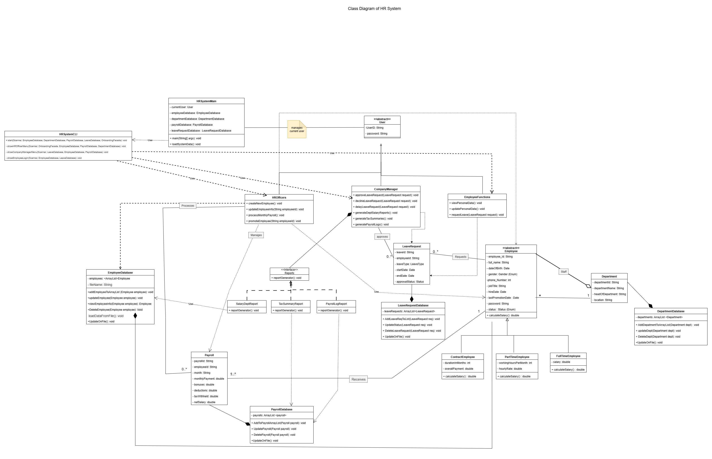

# Advanced-OOP-HR-System
A Java application for managing employees, payroll, and leave requests, designed using SOLID principles and various design patterns.
# HR Management System - Advanced Programming Project

# Overview

This project is a comprehensive Human Resources (HR) Management System developed in Java. It is designed to demonstrate **advanced object-oriented programming (OOP)** concepts, **design patterns**, and principles such as **SOLID**, **Factory**, **Facade**, and **Strategy**.

The system provides a console-based interface for managing employees, departments, payroll, and leave requests. It utilizes file-based persistence to simulate a database environment.

# Key Features

•
User Authentication: Separate login for HR Officers and Company Managers.

•
Employee Management: Add, view, and manage different types of employees (Full-Time, Part-Time, Contract) using the Factory Pattern.

•
Payroll Processing: Calculate and manage payroll for all employees.

•
Leave Management: Employees can request leave, and managers can approve or reject requests.

•
Reporting: Generate various reports, including Payroll Log, Salary by Department, and Tax Summary, using the Strategy Pattern.

•
Onboarding Process: Simplified new employee setup using the Facade Pattern.

•
Data Persistence: Data is loaded from and saved to text files (e.g., `employees_full_time.txt`, `departments.txt`).

# Technology Stack

•
Language: Java

•
Core Concepts: Object-Oriented Programming (OOP)

•
Design Principles: SOLID Principles

•
Design Patterns: Factory, Facade, Strategy

# Project Structure

The project is structured around the `advancedFinal` package, which contains all the core logic and classes.

```
Advanced-final/
├── src/
│   └── advancedFinal/
│       ├── Main.java               # System entry point and initialization
│       ├── HRSystemCLI.java        # Console-based User Interface
│       ├── Employee.java           # Abstract base class for employees
│       ├── FullTimeEmployee.java   # Concrete employee type
│       ├── PartTimeEmployee.java   # Concrete employee type
│       ├── ContractEmployee.java   # Concrete employee type
│       ├── EmployeeFactory.java    # Factory Pattern for creating employees
│       ├── OnboardingFacade.java   # Facade Pattern for simplified onboarding
│       ├── ReportGenerator.java    # Context for Strategy Pattern
│       ├── PayrollLogReport.java   # Strategy Pattern implementation
│       ├── SalaryDeptReport.java   # Strategy Pattern implementation
│       ├── TaxSummaryReport.java   # Strategy Pattern implementation
│       └── ... (Database and other utility classes)
└── Dataset-20250902/
    ├── departments.txt             # Data file for departments
    ├── employees_*.txt             # Data files for different employee types
    └── ... (other data files)
```

## System Architecture - Class Diagram
# UML Diagrams
The following Class Diagram illustrates the structure and relationships between the core components of the HR System.


The design of the system is based on the **Class Diagram** which illustrates the relationships and structure of the classes.

**Final Design Diagram:**



**Initial Design Diagram:**




The design of the system is based on the Class Diagram which illustrates the relationships and structure of the classes.


# Installation and Execution

Prerequisites

•
Java Development Kit (JDK) 8 or higher.

•
An IDE like Eclipse or IntelliJ IDEA is recommended for easy project setup.

Running from Command Line

1. Navigate to the project root:

2. Compile the source code:

3. Run the application:

The application will start the console-based HR System CLI.

